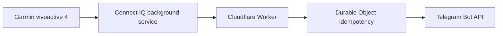

# Garmin Battery Alert

## Overview

Garmin Battery Alert is a Connect IQ watch app for the Garmin vivoactive 4. It monitors battery and charging state during scheduled background execution and sends low-battery or full-charge notifications through a self-hosted Cloudflare Worker to Telegram.

The complete production path and every trigger/rearm condition have been validated on a physical vivoactive 4.

## Features

- Five-minute background battery monitoring
- Low-battery and full-charge notifications
- Persisted armed/disarmed state across app launches
- Persisted pending events with safe background retries
- Durable Object idempotency to suppress ordinary duplicate delivery
- On-watch battery, charging, scheduling, relay, pending, delivery, and HTTP diagnostics
- Deliberate `Queue relay test` troubleshooting action
- Configurable relay URL and API key through Connect IQ App Settings

## Battery logic

Decisions use Garmin's raw floating-point battery value.

| Transition | Exact rule | Telegram message |
|---|---|---|
| Low trigger | Battery `<= 5%` and not charging | Yes |
| Low rearm | Battery `>= 10%` | No |
| Full trigger | Battery `>= 99%` and charging | Yes |
| Full rearm | Not charging and battery `<= 95%` | No |

A trigger disarms that alert until its rearm rule is satisfied. Low and full state machines are independent. Rearm transitions update local state only and do not send Telegram messages.

## Architecture



The watch persists an event before attempting delivery. Failed requests retain the same event ID and payload for a later background retry. The Worker records only successfully delivered event IDs; a repeated delivered ID is acknowledged without sending a second Telegram request.

## Repository layout

- `watch-app/` — Monkey C source, resources, manifest, and settings
- `cloudflare-worker/` — TypeScript Worker, Durable Object, tests, and Wrangler configuration
- `scripts/` — safe PRG and Beta IQ build scripts
- `config/` — local build-environment example
- `docs/` — public validation and development notes

## Requirements

The canonical build was tested with:

- Garmin Connect IQ SDK 9.2.0
- Java 25.0.4
- Node.js 24.14.0
- pnpm 11.16.0
- Wrangler 4.x as a project-local dependency
- Garmin vivoactive 4

The manifest requires Connect IQ API 3.2.0. Use a Java version supported by your selected Connect IQ SDK. No other Garmin device has been tested or declared as a build target.

You also need a Garmin developer key, a Cloudflare account, and a Telegram bot/chat that you control.

## Quick start

1. Create a Telegram bot and identify the destination chat ID.
2. Install the Worker dependencies and choose a unique Worker name.
3. Configure the three Worker secrets and deploy your own relay.
4. Set your relay URL and matching API key in Connect IQ App Settings.
5. Configure `CONNECT_IQ_SDK` and `GARMIN_DEVELOPER_KEY` locally.
6. Build the PRG, or build a Beta IQ package with your own Beta application ID.
7. Validate diagnostics before deliberately queuing one relay test.

## Telegram setup

1. Use Telegram's official `@BotFather` account to create a bot.
2. Send a message to that bot from the destination chat.
3. Use Telegram's Bot API `getUpdates` method locally to identify the numeric `chat.id` from that message.
4. Keep both the bot token and chat ID private. Do not place either value in this repository or in shell history.

The Worker constructs alert text server-side. The watch never receives the Telegram bot token or chat ID.

## Cloudflare setup

Deploy your own relay. The canonical endpoint is not a shared public alert service.

```sh
cd cloudflare-worker
pnpm install --frozen-lockfile
pnpm wrangler login
pnpm wrangler whoami
```

Forks should change the Worker `name` in `wrangler.jsonc` before deployment. The Durable Object binding and SQLite migration are already declared in that file and are applied by Wrangler during deployment.

Create a cryptographically random relay API key, then enter each value only at Wrangler's secret prompt:

```sh
pnpm wrangler secret put TELEGRAM_BOT_TOKEN
pnpm wrangler secret put TELEGRAM_CHAT_ID
pnpm wrangler secret put RELAY_API_KEY
pnpm wrangler deploy
```

Verify your deployment with `GET /health`. Its `workers.dev` origin becomes the watch's `RelayBaseUrl`. Secret values must remain in Cloudflare secrets, not Wrangler configuration or tracked files.

See the [Worker README](cloudflare-worker/README.md) for endpoint, idempotency, local-test, and deployment details.

## Garmin configuration

The app requires the manifest's `Background` and `Communications` permissions.

Configure these Connect IQ App Settings:

- `RelayBaseUrl` — the HTTPS origin of your own Worker, without `/alert`
- `RelayApiKey` — the same random value stored as the Worker's `RELAY_API_KEY` secret

`RelayApiKey` is a password setting with an intentionally empty default. The repository's default relay URL describes the canonical deployment; forks and self-hosters must replace it with their own URL.

The manifest contains this project's canonical production identity. Forks that publish or distribute their own build must generate their own production application ID and explicitly supply their own Beta application ID.

## Build

Copy the local environment template, edit only the ignored copy, and load it into the current shell:

```sh
cp config/build.env.example config/build.env
${EDITOR:-vi} config/build.env
set -a
. ./config/build.env
set +a
```

Build the vivoactive4 PRG:

```sh
./scripts/build-watch-app.sh
```

Output:

- `build/GarminBatteryAlert.prg`
- `build/GarminBatteryAlert-settings.json`

Build a Garmin Connect IQ Beta package:

```sh
./scripts/build-beta-iq.sh
```

Output: `build/beta/GarminBatteryAlert-beta.iq`.

`CONNECT_IQ_SDK` and `GARMIN_DEVELOPER_KEY` are required. `GARMIN_BETA_APP_ID` is also required for every Beta IQ build; the script never falls back to the maintainer's identity. Both scripts derive the repository root from their own location and atomically promote only successful output.

The scripts use Bash plus common POSIX utilities. They are validated on macOS; other systems may require an equivalent Garmin SDK installation and compatible shell utilities.

## Testing

Worker validation is local and sends no Telegram messages:

```sh
cd cloudflare-worker
pnpm test
pnpm typecheck
pnpm check
```

The Monkey C tests in `BatteryAlertTests.mc` cover threshold boundaries, pending-event persistence, response classification, and the foreground test event. Run them with the Connect IQ SDK/VS Code test workflow for `vivoactive4`.

`Queue relay test` requires a deliberate foreground tap. It refuses to overwrite an existing pending event and uses the normal persisted background/retry path without changing either alert's state. Use it only against your own configured relay and expect one real Telegram message.

On the author's physical vivoactive 4, the controlled relay test and all four real battery transitions were verified: low trigger at 5%, low rearm at 10%, full trigger at 99% while charging, and full rearm after unplugging at 95% or below. See [Validation](docs/VALIDATION.md).

## Security

- Never commit bot tokens, chat IDs, relay keys, developer keys, or local environment files.
- Store Worker credentials with `wrangler secret put`.
- Provision the relay key to the watch only through Connect IQ App Settings.
- Keep local credentials outside Git; the supplied `.gitignore` excludes common secret and build files.
- Treat logs, screenshots, command history, and test payloads as possible disclosure channels.
- This repository contains no production credential values.

## Privacy

The canonical deployment's privacy policy is available at:

<https://garmin-battery-alert-relay.garmin-battery-alert-relay.workers.dev/privacy>

That policy applies to the canonical deployment only. Forks and self-hosted deployments are responsible for publishing and maintaining privacy information appropriate to their own data handling and services.

## Development

This project was developed with substantial assistance from OpenAI Codex.

AI assistance included implementation, testing, debugging, documentation, and project setup. Final behavior was validated on a physical Garmin vivoactive 4. OpenAI does not endorse, maintain, or support this project.

## Disclaimer

This project is provided “as is,” without warranty of any kind. Installation, configuration, deployment, and use are at your own responsibility. You are responsible for reviewing the code and protecting all credentials. The authors are not responsible for device behavior, missed alerts, service interruptions, data loss, API or platform changes, or other consequences arising from use of the project.

## License

Licensed under the [MIT License](LICENSE).
